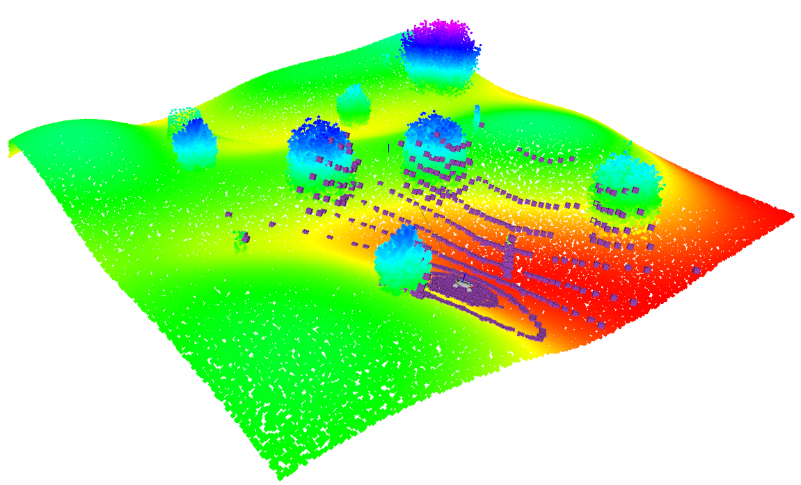

# ROS2 Diff-drive Robot Simulator 

## Overview

This ROS 2 package simulates a differential-drive robot in a 3D environment using a mesh model and a point cloud map. The robot's pose is updated based on velocity commands (`/cmd_vel`), and its height and orientation are estimated using Principal Component Analysis (PCA) on the surrounding point cloud data. The simulation includes visualization of the robot model, publishing of odometry, and broadcasting of the robot's transform.

---

## Features

- **Robot Model Visualization**: The robot is visualized using a 3D mesh model.
- **Point Cloud Map**: The environment is represented by a point cloud map loaded from a PCD file.
- **Height and Pose Estimation**: The robot's height and orientation are estimated using PCA on the point cloud data.
- **Odometry Publishing**: The robot's odometry is published to the `/odom` topic.
- **TF Broadcasting**: The robot's transform is broadcasted using TF.
- **Velocity Control**: The robot's linear and angular velocities are controlled via the `/cmd_vel` topic.

---

## Dependencies

- **ROS 2** (tested with Foxy and Humble)
- **PCL (Point Cloud Library)**
- **Eigen**

---

## Usage

1. **Launch the simulation**:
   ```bash
   ros2 run robot_simulator robot_simulator
   ```

2. **Send velocity commands** to the robot using the `/cmd_vel` topic. For example, to move the robot:
   ```bash
   ros2 run teleop_twist_keyboard teleop_twist_keyboard
   ```

3. **Visualize the robot model** and point cloud map in RViz:
   ```bash
   rviz2 -d src/simulation_env/rviz/simulation.rviz
   ```

4. **Launch lidar**:
   ```bash
   ros2 run simulation_env simulated_lidar  
   ```
---

## Parameters

The following parameters can be adjusted in the `RobotSimulatorParams` struct within the code:

### Model Parameters
- `mesh_resource`: Path to the robot's mesh model.
- `mesh_scale`: Scale of the mesh model.
- `mesh_offset_x`, `mesh_offset_y`: Offset of the mesh model's center.

### Control Parameters
- `max_linear_vel`: Maximum linear velocity.
- `max_angular_vel`: Maximum angular velocity.
- `control_rate`: Control loop frequency in Hz.

### Point Cloud Parameters
- `pcd_file_path`: Path to the PCD file containing the point cloud map.
- `search_radius`: Radius for searching neighboring points.
- `min_neighbors`: Minimum number of neighboring points required for height estimation.

### Height Estimation Parameters
- `height_offset`: Height offset for the robot's pose.

---

## Customization

- **Robot Model**: Replace the `robot.dae` file with your own mesh model and update the `mesh_resource` parameter accordingly.
- **Point Cloud Map**: Replace the `forest.pcd` file with your own point cloud map and update the `pcd_file_path` parameter.

---

## Troubleshooting

- **Failed to load PCD file**: Ensure the path to the PCD file is correct and the file exists.
- **No visualization in RViz**: Check that the correct topics are being displayed and that the robot model and point cloud are correctly loaded.

---

## License

This project is licensed under the MIT License. See the [LICENSE](LICENSE) file for details.

---

## Contributing

Contributions are welcome! Please open an issue or submit a pull request for any improvements or bug fixes.

---

## Acknowledgments

- **ROS 2**: For providing the framework for robot simulation.
- **PCL**: For point cloud processing capabilities.
- **Eigen**: For linear algebra operations.

---
